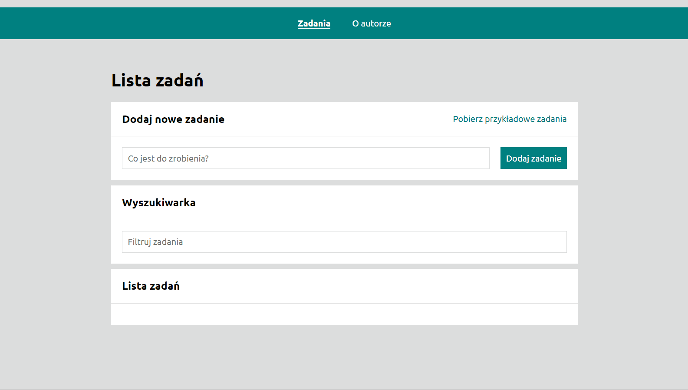

# TODO LIST

## Task list using React app

## Demo

<https://waltad.github.io/todo-list-react/>

## Description

This project was bootstrapped with [Create React App](https://github.com/facebook/create-react-app).
Project made as part of training exercises in Java Script and tools supporting work in the frontend.

## Instruction

1. Enter the task.
2. Confirm the task and it will appear in the window at the bottom.
3. Repeat steps 1 and 2 until you have entered all tasks.
4. Click the icon on the left if you have completed the task.
5. Click the icon on the right if you want to delete the task.
6. If there are any tasks to do, the top menu will appear.
   - Click the "Hide Completed" button and the completed tasks will disappear from the screen.
   - Clicking the button again will show all tasks.
   - Clicking the Complete All button will display all tasks as completed and will disable this button.

## Tech

TODO LIST uses a number of open source projects to work properly:

- [HTML] - HyperText Markup Language
- [JS] - JavaScript
- [CSS] - Cascading Style Sheets
- [React] - JavaScript library for building JavaScript apps in a browser:
  - syled-components,
  - hooks,
  - custom-hooks,
  - GlobalStyles,
  - theme,
- [React Router]: HashRouter, Switch, Route, Redirect
- [Redux] - an open-source JavaScript library for managing and centralizing application state:
- [Redux-Saga] - An intuitive Redux side effect manager
- [Redux-Toolkit]
- [BEM] - Blocks, Elements and Modifiers - CSS block naming technology that takes page layout into account
- [Media queries] - allow you to apply CSS styles depending on the presence or value of device characteristics

## Available Scripts

In the project directory, you can run:

### `npm start`

Runs the app in the development mode.\
Open [http://localhost:3000](http://localhost:3000) to view it in your browser.

The page will reload when you make changes.\
You may also see any lint errors in the console.

### `npm run build`

Builds the app for production to the `build` folder.\
It correctly bundles React in production mode and optimizes the build for the best performance.

The build is minified and the filenames include the hashes.\
Your app is ready to be deployed!

See the section about [deployment](https://facebook.github.io/create-react-app/docs/deployment) for more information.

### `npm run eject`

**Note: this is a one-way operation. Once you `eject`, you can't go back!**

If you aren't satisfied with the build tool and configuration choices, you can `eject` at any time. This command will remove the single build dependency from your project.

Instead, it will copy all the configuration files and the transitive dependencies (webpack, Babel, ESLint, etc) right into your project so you have full control over them. All of the commands except `eject` will still work, but they will point to the copied scripts so you can tweak them. At this point you're on your own.

You don't have to ever use `eject`. The curated feature set is suitable for small and middle deployments, and you shouldn't feel obligated to use this feature. However we understand that this tool wouldn't be useful if you couldn't customize it when you are ready for it.
